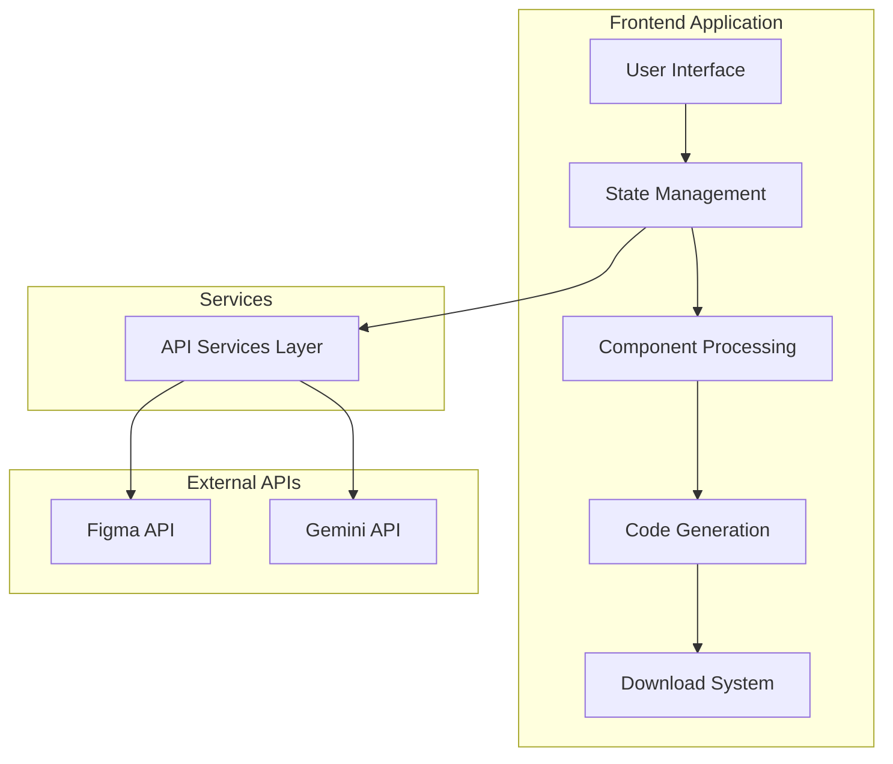

# Design Document

## Overview

The Figma-to-React Generator is a web application that transforms Figma designs into functional React components using the Figma API and Google's Gemini LLM API. The application provides a streamlined workflow for developers to input Figma credentials, preview designs, generate React code, and download complete project packages.

The system is built with React, Material-UI, and Vite, focusing on performance optimization to handle large Figma files while staying within Gemini's 8k token limit. The architecture emphasizes modularity, error handling, and user experience.

## Architecture

### High-Level Architecture



### System Flow

1. **Authentication & Input**: User provides Figma URL and API token
2. **Data Fetching**: System fetches design data from Figma API with optimization
3. **Processing**: Components are extracted, filtered, and optimized for token limits
4. **Generation**: Gemini API generates React code based on processed design data
5. **Preview & Download**: User previews generated code and downloads complete project

## Components and Interfaces

### Core Components

#### 1. FileInput Component
- **Purpose**: Handle Figma credentials input and initial file loading
- **Props**: `onLoadFile`, `loading`, `error`, `darkMode`, `onToggleDarkMode`
- **Features**: 
  - Figma URL validation
  - API token secure input
  - Loading states and error handling
  - Dark/light mode toggle

#### 2. ComponentList Component
- **Purpose**: Display paginated list of Figma components
- **Props**: `components`, `selectedComponent`, `onComponentSelect`, `loading`, `pageGenerationMode`, etc.
- **Features**:
  - Pagination with memory optimization
  - Component type filtering
  - Multi-select for page generation mode
  - Search and sorting capabilities

#### 3. DesignPreview Component
- **Purpose**: Show visual preview of selected Figma components
- **Props**: `selectedComponent`, `componentImage`, `loading`, `pageGenerationMode`
- **Features**:
  - High-resolution component images
  - Zoom and pan functionality
  - Multi-component preview for page mode
  - Loading states with skeleton UI

#### 4. CodeDisplay Component
- **Purpose**: Display generated React code with syntax highlighting
- **Props**: `generatedCode`, `loading`, `error`, `selectedComponent`, `onGenerateCode`
- **Features**:
  - Syntax highlighting with react-syntax-highlighter
  - Full scrollable code viewer
  - Copy to clipboard functionality
  - Download project package button
  - Error display and retry options

### Service Layer

#### 1. Figma API Service (`figmaApi.js`)
- **Enhanced Functions**:
  - `getFigmaFile()`: Fetch complete file data with error handling
  - `getFigmaImages()`: Get high-resolution component images
  - `extractSimplifiedMetadata()`: Optimize component data for token limits
  - `getComponentsWithPagination()`: Memory-efficient component loading
  - `getComponentsByType()`: Filter components by type
  - `extractAllTextContent()`: Comprehensive text extraction

#### 2. Gemini API Service (`geminiApi.js`)
- **Enhanced Functions**:
  - `generateReactComponent()`: Generate individual components with token optimization
  - `generateCompletePage()`: Generate full page layouts
  - `createMinimalPrompt()`: Ultra-minimal prompts for large components
  - `estimateTokenCount()`: Token estimation for optimization
  - `extractPageStructure()`: Analyze page layout and hierarchy

### State Management

#### Application State Structure
```javascript
{
  // File and authentication
  fileLoaded: boolean,
  fileKey: string,
  accessToken: string,
  
  // Component data
  components: Array<Component>,
  allComponentsData: FigmaFileData,
  selectedComponent: Component | null,
  componentImage: string | null,
  
  // Generation state
  generatedCode: string,
  loading: boolean,
  codeLoading: boolean,
  error: string,
  
  // Pagination and filtering
  currentPage: number,
  pageSize: number,
  totalComponents: number,
  hasMore: boolean,
  componentType: string,
  
  // Page generation mode
  pageGenerationMode: boolean,
  selectedComponentsForPage: Array<Component>,
  
  // UI state
  darkMode: boolean,
  snackbar: { open: boolean, message: string, severity: string }
}
```

## Data Models

### Component Metadata Model
```typescript
interface ComponentMetadata {
  // Basic properties
  id: string;
  name: string;
  type: string;
  width: number;
  height: number;
  x: number;
  y: number;
  
  // Text content
  characters: string;
  hasText: boolean;
  allTextContent: Array<TextElement>;
  
  // Layout properties
  layoutMode: 'HORIZONTAL' | 'VERTICAL' | null;
  primaryAxisAlignItems: string;
  counterAxisAlignItems: string;
  padding: { left: number, right: number, top: number, bottom: number };
  itemSpacing: number;
  
  // Visual properties
  fills: Array<FillInfo>;
  strokes: Array<StrokeInfo>;
  effects: Array<EffectInfo>;
  cornerRadius: number;
  opacity: number;
  
  // Typography
  fontSize: number;
  fontFamily: string;
  fontWeight: number;
  textAlign: string;
  
  // Hierarchy
  children: Array<ComponentMetadata>;
  visible: boolean;
}
```

### Page Structure Model
```typescript
interface PageStructure {
  pageName: string;
  pageWidth: number;
  pageHeight: number;
  layout: 'vertical' | 'sidebar' | 'header-footer';
  header: ElementInfo | null;
  hero: ElementInfo | null;
  main: ElementInfo | null;
  footer: ElementInfo | null;
  sidebar: ElementInfo | null;
  components: Array<ElementInfo>;
}
```

## Error Handling

### Error Categories and Strategies

#### 1. API Errors
- **Figma API Errors**: Invalid tokens, rate limits, network issues
- **Gemini API Errors**: Token limits, content policy, service unavailable
- **Strategy**: Exponential backoff, user-friendly error messages, retry mechanisms

#### 2. Data Processing Errors
- **Large File Handling**: Memory optimization, pagination, component filtering
- **Token Limit Errors**: Automatic prompt optimization, component simplification
- **Strategy**: Graceful degradation, progressive loading, user feedback

#### 3. UI/UX Errors
- **Loading States**: Skeleton UI, progress indicators, timeout handling
- **User Input Errors**: Validation, clear error messages, guided recovery
- **Strategy**: Immediate feedback, contextual help, error boundaries

### Error Recovery Mechanisms
```javascript
// Automatic retry with exponential backoff
const retryWithBackoff = async (fn, maxRetries = 3) => {
  for (let i = 0; i < maxRetries; i++) {
    try {
      return await fn();
    } catch (error) {
      if (i === maxRetries - 1) throw error;
      await new Promise(resolve => setTimeout(resolve, Math.pow(2, i) * 1000));
    }
  }
};

// Token limit optimization
const optimizeForTokenLimit = (metadata, maxTokens = 6000) => {
  const estimated = estimateTokenCount(JSON.stringify(metadata));
  if (estimated > maxTokens) {
    return createMinimalPrompt(metadata);
  }
  return createDetailedPrompt(metadata);
};
```

## Testing Strategy

### Unit Testing
- **Component Testing**: React Testing Library for UI components
- **Service Testing**: Mock API responses, error scenarios
- **Utility Testing**: Data processing functions, token estimation

### Integration Testing
- **API Integration**: Test Figma and Gemini API interactions
- **End-to-End Workflows**: Complete user journeys from input to download
- **Error Scenarios**: Network failures, invalid inputs, token limits

### Performance Testing
- **Memory Usage**: Large Figma file handling, component pagination
- **Token Optimization**: Prompt size validation, generation speed
- **UI Responsiveness**: Loading states, smooth interactions

### Test Structure
```javascript
// Component tests
describe('CodeDisplay Component', () => {
  test('displays generated code with syntax highlighting', () => {});
  test('handles scrolling for long code blocks', () => {});
  test('shows download button when code is ready', () => {});
  test('displays error states appropriately', () => {});
});

// Service tests
describe('Figma API Service', () => {
  test('fetches file data with proper error handling', () => {});
  test('optimizes component data for token limits', () => {});
  test('handles pagination correctly', () => {});
});

// Integration tests
describe('Code Generation Flow', () => {
  test('complete workflow from Figma input to code download', () => {});
  test('handles token limit optimization', () => {});
  test('generates downloadable project structure', () => {});
});
```

## Performance Optimizations

### Memory Management
- **Component Pagination**: Load components in chunks of 20-50
- **Data Simplification**: Remove unnecessary metadata for token optimization
- **Image Lazy Loading**: Load component images on demand
- **Cleanup**: Proper cleanup of large objects and event listeners

### Token Optimization
- **Prompt Engineering**: Minimal prompts for large components
- **Content Prioritization**: Focus on essential design elements
- **Batch Processing**: Group related components for efficient generation
- **Fallback Strategies**: Ultra-minimal prompts when limits are exceeded

### UI Performance
- **Virtual Scrolling**: For large component lists
- **Debounced Search**: Optimize filtering and search operations
- **Skeleton Loading**: Smooth loading states
- **Code Splitting**: Lazy load heavy components

## Download System Architecture

### Project Structure Generation
```
downloaded-project/
├── package.json (with all dependencies)
├── vite.config.js
├── index.html
├── .env.example
├── src/
│   ├── main.jsx
│   ├── App.jsx (generated component)
│   ├── index.css
│   └── components/
│       └── GeneratedComponent.jsx
└── public/
    └── vite.svg
```

### Download Implementation
```javascript
const generateDownloadPackage = (generatedCode, componentName) => {
  const projectStructure = {
    'package.json': generatePackageJson(),
    'vite.config.js': generateViteConfig(),
    'index.html': generateIndexHtml(),
    'src/main.jsx': generateMainFile(),
    'src/App.jsx': wrapGeneratedCode(generatedCode),
    'src/index.css': generateBasicStyles(),
    '.env.example': generateEnvExample()
  };
  
  return createZipArchive(projectStructure);
};
```

## Security Considerations

### API Key Management
- Environment variables for API keys
- Client-side key validation
- Secure transmission over HTTPS
- No server-side storage of credentials

### Data Privacy
- No persistent storage of Figma data
- Session-based component caching
- Clear data on page refresh
- User consent for API usage

### Input Validation
- Figma URL format validation
- API token format checking
- Sanitization of generated code
- XSS prevention in code display